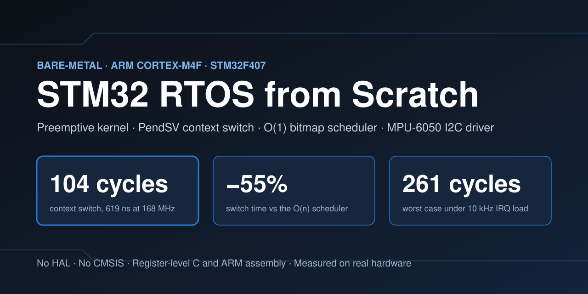
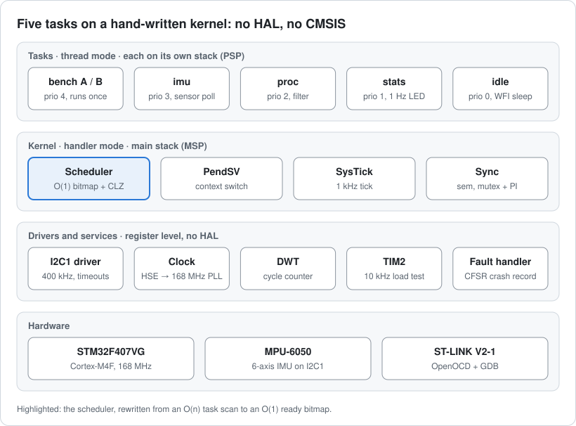
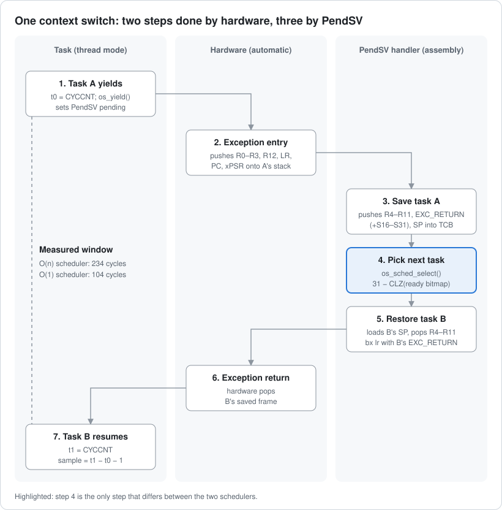
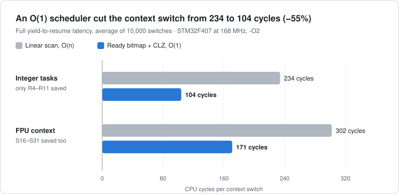
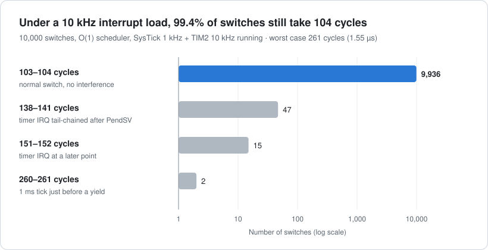
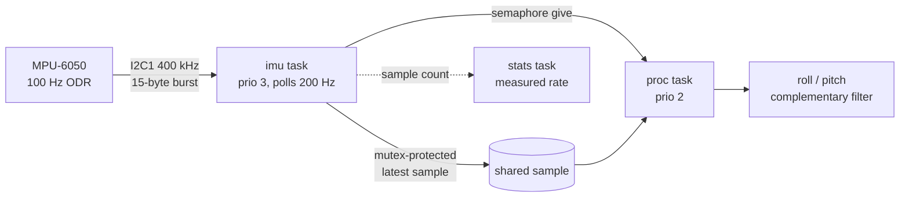

# STM32 RTOS from Scratch: Bare-Metal Preemptive Kernel for ARM Cortex-M4 (STM32F407)




A **preemptive real-time operating system (RTOS) written from scratch** for the **STM32F407 (ARM Cortex-M4F)**, with no HAL, no CMSIS and no vendor startup code. It has a **PendSV context switcher** with FPU lazy stacking, a **SysTick-driven priority scheduler** with an **O(1) ready-bitmap + CLZ** design, **semaphores and mutexes with priority inheritance**, a **register-level I2C driver for the MPU-6050 IMU**, and a **DWT cycle-counter benchmark** that measured every number on this page on real hardware.

If you want to see how an RTOS actually switches tasks on a Cortex-M, this repository walks through it from the reset vector up, with measurements.

## Results at a glance

| Metric | Result | How it was measured |
| --- | --- | --- |
| Context switch, O(1) scheduler | **104 cycles (619 ns at 168 MHz)** | DWT CYCCNT, yield until the next task runs, 10,000 switches |
| Context switch, original O(n) scheduler | 234 cycles | same benchmark, `SCHED=linear` |
| Improvement | **55% less time per switch** | only the scheduler changed |
| Switch with FPU context saved | 171 cycles (+67 for S0–S31) | `BENCH_FPU=1` |
| Worst case under 10 kHz interrupt load | **261 cycles (1.55 µs)** | SysTick 1 kHz + TIM2 10 kHz running |
| Switches at the typical value under load | 99.4% | 9,936 of 10,000 |
| Priority inheritance self-test | PASS | on-target priority inversion scenario |

All figures: STM32F4-Discovery, 168 MHz, `-O2`, flash ART accelerator on, 6 tasks.

## Contents

- [Features](#features)
- [Architecture](#architecture)
- [How the context switch works](#how-the-context-switch-works)
- [O(1) scheduler: ready bitmap + CLZ](#o1-scheduler-ready-bitmap--clz)
- [Benchmark: measuring the context switch with the DWT cycle counter](#benchmark-measuring-the-context-switch-with-the-dwt-cycle-counter)
- [Real-time behaviour under interrupt load](#real-time-behaviour-under-interrupt-load)
- [Synchronisation and priority inheritance](#synchronisation-and-priority-inheritance)
- [MPU-6050 sensor pipeline over I2C](#mpu-6050-sensor-pipeline-over-i2c)
- [Fault handling](#fault-handling)
- [Quick start](#quick-start)
- [Build options and make targets](#build-options-and-make-targets)
- [Project structure](#project-structure)
- [Roadmap](#roadmap)
- [References](#references)

## Features

**Kernel**

- Preemptive, priority-based scheduling (32 levels) with round-robin time slicing at equal priority
- Context switching in the **PendSV** exception, written in ARM Thumb-2 assembly
- **FPU-aware**: saves S16–S31 only for tasks that used the FPU (lazy stacking via EXC_RETURN bit 4)
- **O(1) scheduler**: 32-bit ready bitmap, per-priority circular ready lists, `CLZ` instruction
- 1 kHz **SysTick** tick: sleeping tasks, timeouts, time slices
- First task launched through **SVC**, with MSP reset and CONTROL cleared
- `os_delay()` and drift-free periodic `os_delay_until()`
- Counting **semaphores** (ISR-safe give, direct hand-off to the waiter, timeouts)
- **Mutexes** with ownership and **priority inheritance**
- Static allocation only: no heap, no `malloc`

**Bare-metal platform**

- Hand-written register map, vector table, `Reset_Handler` and linker script (FLASH, SRAM, CCM RAM, `.noinit`)
- Clock tree: 8 MHz HSE → PLL → **168 MHz**, flash wait states and ART accelerator configured by hand
- **Register-level I2C1 driver** at 400 kHz with timeouts and bus recovery
- **MPU-6050** configured for a 100 Hz output data rate, with a complementary filter for roll and pitch
- Custom **HardFault / BusFault / UsageFault / MemManage** handler that decodes CFSR and survives reset

**Verification**

- DWT cycle-counter benchmark over 10,000 switches with a host-side analysis script
- Interrupt-load mode (SysTick + 10 kHz TIM2) for realistic worst-case latency
- On-target kernel self-test for priority inheritance and semaphore timeouts
- Deliberate fault injection to verify the fault handler

## Architecture



The kernel runs in handler mode on the main stack (MSP). Each task runs in thread mode on its own process stack (PSP).

| Task | Priority | Role |
| --- | --- | --- |
| `bench_a`, `bench_b` | 4 | context switch benchmark; run once at boot, then exit |
| `imu` | 3 | polls the MPU-6050 every 5 ms, publishes each new sample |
| `proc` | 2 | waits on a semaphore, computes roll and pitch |
| `stats` | 1 | measures the real IMU sample rate, blinks the heartbeat LED |
| `idle` | 0 | `WFI` until the next interrupt |

Exception priorities: TIM2 `0xD0` (load test only), SysTick `0xE0`, **PendSV `0xF0` (lowest)**. PendSV is the lowest so that a context switch never interrupts another handler.

## How the context switch works



On exception entry the Cortex-M4 hardware pushes R0–R3, R12, LR, PC and xPSR onto the running task's stack. PendSV only has to save what the hardware does not, R4–R11, plus S16–S31 if the task used the FPU:

```asm
PendSV_Handler:
    cpsid   i
    mrs     r0, psp                 @ task stack pointer (after hardware stacking)
    tst     lr, #0x10               @ EXC_RETURN bit 4 == 0 -> FPU frame
    it      eq
    vstmdbeq r0!, {s16-s31}         @ save callee-saved FPU registers
    stmdb   r0!, {r4-r11, lr}       @ save callee-saved core registers + EXC_RETURN
    ldr     r1, =os_curr
    ldr     r2, [r1]
    str     r0, [r2]                @ os_curr->sp = r0

    bl      os_sched_select         @ r0 = next TCB
    ldr     r1, =os_curr
    str     r0, [r1]

    ldr     r0, [r0]                @ next->sp
    ldmia   r0!, {r4-r11, lr}       @ restore core registers and its EXC_RETURN
    tst     lr, #0x10
    it      eq
    vldmiaeq r0!, {s16-s31}
    msr     psp, r0                 @ hardware unstacks the rest
    cpsie   i
    bx      lr                      @ exception return into the next task
```

Each new task starts with a hand-built exception frame (xPSR `0x01000000`, PC = task entry, LR = task exit, EXC_RETURN `0xFFFFFFFD`), so its first run looks exactly like a return from an interrupt.

## O(1) scheduler: ready bitmap + CLZ

The first version scanned every task control block inside PendSV to find the highest-priority ready task. That scan dominated the switch, and its cost grew with the number of tasks.

The current scheduler keeps:

1. **one circular ready list per priority** (32 levels), and
2. **a 32-bit ready bitmap** where bit *p* is set when priority *p* has a ready task.

Finding the highest ready priority is one Cortex-M4 instruction, `CLZ` (count leading zeros):

```c
static inline uint32_t highest_ready_prio(void)
{
    return 31U - (uint32_t)__builtin_clz(s_ready_bitmap);   /* compiles to CLZ */
}

tcb_t *os_sched_select(void)
{
    uint32_t p = highest_ready_prio();
    tcb_t   *t = s_ready_head[p];
    if (t == os_curr && t->next != t) {   /* round robin among equal priority */
        t = t->next;
    }
    s_ready_head[p] = t;
    return t;
}
```

Every state or priority change, including a priority boost from a mutex, goes through `os_task_set_state()` / `os_task_set_prio()`, which keep the lists and the bitmap consistent. The original scan is still available with `make SCHED=linear` for comparison.

## Benchmark: measuring the context switch with the DWT cycle counter



**Method (ping-pong).** Two tasks at the same top priority take turns:

1. Task A writes `t0 = DWT->CYCCNT`, then calls `os_yield()`.
2. The kernel switches to task B, whose first instruction reads `t1 = DWT->CYCCNT`.
3. `t1 − t0 − calibration` is one sample: the **full task-to-task latency**, including exception entry, PendSV, the scheduler and exception return.

**Making it trustworthy**

- The cost of one CYCCNT read (1 cycle) is measured at start-up and subtracted.
- SysTick is paused and the benchmark tasks outrank all others, so nothing interferes.
- 10,000 samples are stored in CCM RAM, dumped over GDB and analysed by `tools/analyze_cs.py` (mean, median, p99, p99.9, histogram).
- In this isolated mode 9,999 of 10,000 switches take exactly the same number of cycles. The switch path is deterministic.

The **+67 cycles with FPU context** matches the expected work: S16–S31 saved and restored by PendSV, plus S0–S15 and FPSCR lazily stacked and unstacked by hardware.

## Real-time behaviour under interrupt load



`make BENCH_LOAD=1 bench` keeps the 1 kHz SysTick running and adds a TIM2 interrupt at 10 kHz. PendSV masks interrupts while it swaps tasks, so an interrupt that arrives mid-switch waits, then **tail-chains** in before the next task runs. Those samples form the tail of the distribution, and the worst case is **261 cycles**.

**A bug found by measuring.** The first load run counted 157 timer interrupts in about 9 ms, where a 10 kHz timer should give about 90. The TIM2 handler cleared its update flag first thing, but the handler was so short that it returned before the write had crossed the APB1 bridge, so the still-set flag fired the interrupt again. Reading `TIM2->SR` back after the clear forces the write to complete. After the fix: 96 interrupts in 9 ticks.

## Synchronisation and priority inheritance

- **Semaphores** signal between tasks and from ISRs. A give with a waiter hands the token directly to the highest-priority waiter, so there is no race and no retry loop.
- **Mutexes** have an owner and implement **priority inheritance**: when a high-priority task blocks on a mutex, the owner is raised to that priority until it unlocks. This prevents **priority inversion**, the bug that reset the Mars Pathfinder lander in 1997.
- **Critical sections** save and restore PRIMASK, so they nest safely.

`make selftest` runs the classic inversion scenario on the board: L (priority 1) holds a mutex, H (3) waits for it, and M (2) tries to run in between.

| Check | Expected | Measured |
| --- | --- | --- |
| L's priority while holding the mutex | 3 (inherited) | 3 |
| L's priority after unlocking | 1 | 1 |
| H acquires the mutex | the tick L releases it | tick 50 = tick 50 |
| M finishes | after H got the mutex | tick 250 |
| Semaphore take with a 7-tick timeout | `-1` after 7 ticks | `-1` after 7 ticks |
| **Result** | | **PASS** |

## MPU-6050 sensor pipeline over I2C



**I2C driver (`src/i2c.c`)**

- I2C1 on PB6 (SCL) / PB7 (SDA), open-drain, alternate function 4
- 400 kHz fast mode from PCLK1 = 42 MHz: `CCR = 42 MHz / (3 × 400 kHz) = 35`, `TRISE = 13`
- The STM32F4 receive sequences for 1, 2 and more than 2 bytes, as given in RM0090 (ACK and STOP timed against BTF)
- A timeout on every wait, NACK detection, peripheral reset on bus errors
- **Bus recovery**: up to 9 manual SCL pulses if a slave holds SDA low after a reset

**MPU-6050 configuration (`src/mpu6050.c`)**

| Register | Value | Effect |
| --- | --- | --- |
| `WHO_AM_I` (0x75) | expect `0x68` | device check |
| `PWR_MGMT_1` (0x6B) | `0x80`, then `0x01` | reset, then wake on the gyro PLL clock |
| `CONFIG` (0x1A) | `0x03` | 44 Hz low-pass filter, 1 kHz internal rate |
| `SMPLRT_DIV` (0x19) | `9` | 1 kHz / (1 + 9) = **100 Hz** |
| `GYRO_CONFIG` / `ACCEL_CONFIG` | `0x00` | ±250 °/s, ±2 g |
| `INT_ENABLE` (0x38) | `0x01` | data-ready flag per sample |

The IMU task polls at twice the output rate and uses a sample only when the data-ready bit is set, so each sample is read exactly once. The `stats` task reports the measured rate in `g_imu.rate_hz`.

> **Status:** the full pipeline (mutex, semaphore, filter task) runs on the board with synthetic 100 Hz data (`make SIM_IMU=1`). Bring-up of the driver on a physical MPU-6050 module is in progress.

## Fault handling

All four fault exceptions share one handler:

1. A small assembly stub checks EXC_RETURN bit 2 to find the stack (MSP or PSP) that holds the exception frame.
2. The C handler copies the stacked PC, LR, xPSR and R0–R3 plus **CFSR, HFSR, MMFAR and BFAR** into a record in `.noinit` RAM.
3. With a debugger attached it stops on `BKPT`. Without one it lights the red LED and resets, and the next boot reports the previous crash.

The `fault` GDB command decodes the record into named CFSR bits and prints the faulting source line. `make FAULT_TEST=1..4` injects divide-by-zero, a precise bus error, an undefined instruction and an invalid-state branch to verify each path.

## Quick start

**Hardware:** STM32F4-Discovery (STM32F407VG) with its on-board ST-LINK, connected over the mini-USB port. Optional: an MPU-6050 (GY-521) module.

| GY-521 pin | Discovery pin |
| --- | --- |
| VCC | 3V |
| GND | GND |
| SCL | PB6 |
| SDA | PB7 |
| AD0 | GND (address 0x68) |

**Toolchain (macOS shown; Linux works the same with your package manager):**

```bash
brew install --cask gcc-arm-embedded   # arm-none-eabi-gcc, newlib, arm-none-eabi-gdb
brew install openocd
```

**Build, flash and benchmark:**

```bash
git clone https://github.com/bhoomikbhamawat/stm32-rtos-imu.git
cd stm32-rtos-imu
make                  # build build/rtos_imu.elf
make SIM_IMU=1 flash  # run the full pipeline without a sensor
make bench            # flash, run 10,000 switches, print the statistics
```

`make bench` starts OpenOCD, breaks on `cs_bench_complete()`, prints average, worst and best cycles, and dumps the raw samples for `tools/analyze_cs.py`.

**LEDs:** green toggles every second (scheduler alive) · blue toggles every 0.5 s (100 Hz pipeline) · orange means no MPU-6050 found · red means a fault was recorded.

## Build options and make targets

| Command | What it does |
| --- | --- |
| `make` | build with the O(1) scheduler at `-O2` |
| `make flash` | program the board through ST-LINK and OpenOCD |
| `make bench` | context switch benchmark, isolated |
| `make SCHED=linear bench` | same benchmark with the original O(n) scheduler |
| `make BENCH_FPU=1 bench` | benchmark with FPU context in both tasks |
| `make BENCH_LOAD=1 bench` | benchmark under SysTick + 10 kHz TIM2 load |
| `make selftest` | priority inheritance and semaphore timeout test |
| `make SIM_IMU=1` | synthetic 100 Hz IMU data instead of I2C |
| `make FAULT_TEST=n` | inject fault type n (1 to 4) after 3 s |
| `make debug` + `make gdb` | interactive debugging with the `cs`, `tasks`, `imu` and `fault` GDB commands |

Options can be combined, and changing an option triggers a full rebuild automatically.

## Project structure

```text
stm32-rtos-imu/
├── startup/startup_stm32f407.c   vector table, Reset_Handler (FPU on, .data/.bss, clock)
├── linker/stm32f407vg.ld         FLASH / SRAM / CCM RAM map, .noinit, stack reservation
├── inc/stm32f407.h               hand-written register map (RCC, GPIO, I2C, TIM2, SCB, DWT)
├── src/
│   ├── os.c                      TCBs, ready lists, O(1) scheduler, SysTick, delays, start-up
│   ├── os_port.s                 PendSV context switch, SVC first-task launch
│   ├── os_sync.c                 semaphores, mutexes with priority inheritance
│   ├── clock.c                   HSE → PLL → 168 MHz, flash wait states
│   ├── i2c.c                     register-level I2C1 master driver
│   ├── mpu6050.c                 MPU-6050 configuration and burst read
│   ├── cs_bench.c                DWT context switch benchmark (isolated and loaded)
│   ├── fault.c                   fault handlers and crash record
│   └── main.c                    tasks: imu, proc, stats
├── tests/os_selftest.c           on-target priority inheritance test
├── tools/                        GDB scripts and the sample analysis script
└── docs/images/                  diagrams and charts used in this README
```

The whole kernel, drivers and tests are about 2,600 lines of C and assembly.

## Roadmap

- [ ] Validate the I2C driver on a physical MPU-6050 and publish the measured sample rate
- [ ] Sorted delta list so that the SysTick wake-up is O(1) too
- [ ] Stack overflow detection with an MPU guard region
- [ ] BASEPRI-based masking so high-priority interrupts are never delayed by the kernel
- [ ] DMA-driven I2C with the MPU-6050 INT pin driving the semaphore through EXTI
- [ ] Watchdog-based task health monitoring

## References

- [RM0090: STM32F405/415, STM32F407/417, STM32F427/437 and STM32F429/439 reference manual](https://www.st.com/resource/en/reference_manual/dm00031020.pdf)
- [PM0214: STM32 Cortex-M4 MCUs and MPUs programming manual](https://www.st.com/resource/en/programming_manual/pm0214-stm32-cortexm4-mcus-and-mpus-programming-manual-stmicroelectronics.pdf)
- [ARMv7-M Architecture Reference Manual (DDI 0403)](https://developer.arm.com/documentation/ddi0403/latest/)
- [MPU-6000 and MPU-6050 Product Specification, Rev 3.4](https://product.tdk.com/system/files/dam/doc/product/sensor/mortion-inertial/imu/data_sheet/mpu-6000-datasheet1.pdf)
- [MPU-6000/MPU-6050 Register Map and Descriptions, Rev 4.0](https://cdn.sparkfun.com/datasheets/Sensors/Accelerometers/RM-MPU-6000A.pdf)

---

Built by [Bhoomik Bhamawat](https://github.com/bhoomikbhamawat). If this helped you understand how an RTOS works under the hood, a star helps others find it.
